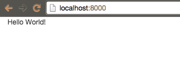
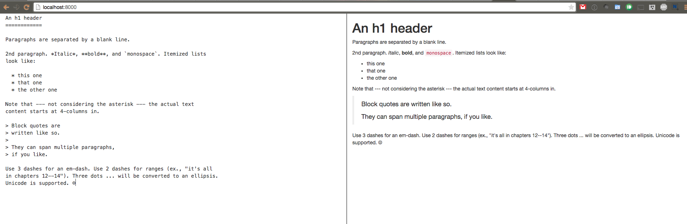

# Building a Real-time Markdown Viewer

## Intro

Markdown is a popular text format written in an easy-to-read way and is convertible to HTML. It is a markup format that has been popularized by sites such as Github and Stack Overflow. Today we will be building an app that let's us view the raw markdown on the left side and the converted markdown (to HTML) on the right side. We will also allow multiple people to work on the same markdown document at the same time via a shareable URL and all changes will be saved.

### Setup Node

Let's get started on our real time markdown viewer app. We will be creating our backend in Node for this application. Create a project directory and then from the command line run the following:

```sh
npm init
```

This will prompt us with several questions. You can fill in the prompts accordingly. This will create a `package.json` file. Here is my sample `package.json` file.

```json
{
  "name": "RealtimeMarkdownViewer",
  "description": "Realtime Markdown Viewer",
  "main": "server.js",
  "version": "1.0.0",
  "repository": {
    "type": "git",
    "url": "git@github.com:sifxtreme/realtime-markdown.git"
  },
  "keywords": [
    "markdown",
    "realtime",
    "sharejs"
  ],
  "author": "Asif Ahmed",
  "dependencies": {
    "express": "^4.12.4",
    "ejs": "^2.3.1",
    "redis": "^0.10.3",
    "share": "0.6.3"
  },
  "engines": {
    "node": "0.10.x",
    "npm": "1.3.x"
  }
}
```

Now let's create a `server.js` file in our root directory. This will be the main server file. We will be using [Express](http://expressjs.com/) as our web application framework. Using Express makes building a server simpler. With Express we will be using [EJS](http://www.embeddedjs.com/) for our view templates. To install Express and EJS run the following commands:

```sh
node install --save express
node install --save ejs
```

Also create a `views` folder and a `public` folder in the root directory.. The `views` folder is where we will be putting our EJS templates and the `public` folder is where will be serving our assets (stylesheets, javascript files, images). Now, we are ready to add some code to our `server.js` file.

```javascript
// server.js

var express = require('express');
var app = express();

// set the view engine to ejs
app.set('view engine', 'ejs');

// public folder to store assets
app.use(express.static(__dirname + '/public'));

// routes for app
app.get('/', function(req, res) {
  res.render('pad');
});

// listen on port 8000 (for localhost) or the port defined for heroku
var port = process.env.PORT || 8000;
app.listen(port);

```

Here we require the Express module, set the rendering engine to EJS, and we have a route for our home page. We also set the `public` directory to be a static directory. Lastly we set the server to listen on port 8000. From our home route, we will be rendering a file called `pad.ejs` from the `view` directory. This is a sample `views/pad.ejs` file.

```html
<!-- views/pad.ejs -->

<!DOCTYPE html>
<html>
<head> 
    <title>Realtime Markdown Viewer</title>
    <link href="https://maxcdn.bootstrapcdn.com/bootstrap/3.3.4/css/bootstrap.min.css" rel="stylesheet">
</head>

<body class="container-fluid">
Hello World!
</body>
</html>
```

For styling, we added [Bootstrap](http://getbootstrap.com/). Let's start up our node server (`node server.js`) and go `http://localhost:8000` in our web browser. You should see something like this:



## Setup View, CSS, and JS Files

We don't want our view file to just say "Hello World!", so let's edit it. We want a text area on the left side where the user can add markdown text and we want an area on the right side where the user can see converted into HTML markdown. If a user edits the text area, we want the markdown area to updated automatically. Stylistically, we want both our textarea and converted markdown area to be 100% height.  

To convert text to HTML, we will be using a library called [Showdown](https://github.com/showdownjs/showdown). Let's review our updated view file.

```html
<!-- views/pad.ejs -->

<!DOCTYPE html>
<html>
<head>
    <title>Realtime Markdown Viewer</title>
    <link href="https://maxcdn.bootstrapcdn.com/bootstrap/3.3.4/css/bootstrap.min.css" rel="stylesheet">
    <link href="style.css" rel="stylesheet">
</head>

<body class="container-fluid">

    <section class="row">
        <textarea class="col-md-6 full-height" id="pad">Write your text here..</textarea>
        <div class="col-md-6 full-height" id="markdown"></div>
    </section>

    <script src="https://cdn.rawgit.com/showdownjs/showdown/1.0.2/dist/showdown.min.js"></script>
    <script src="script.js"></script>

</body>
</html>
```

In the view file, we added links to a CSS and a JS file. We also added the textarea (where we write the markdown) and markdown area (where we view the markdown). Notice that they have specific ID's &mdash; this will be useful for our javascript. Let's add some style now to `public/style.css`.

```css
/* public/style.css */

html, body, section, .full-height {
    height: 100%;
} 

#pad{
    font-family: Menlo,Monaco,Consolas,"Courier New",monospace;

    border: none;
    overflow: auto;
    outline: none;
    resize: none;

    -webkit-box-shadow: none;
    -moz-box-shadow: none;
    box-shadow: none;
}

#markdown {
    overflow: auto;
    border-left: 1px solid black;
}
```

For our javascript file (`public/script.js`) we want to create a function that can convert the textarea text, convert this HTML, and place this HTML in our markdown area. We also want an event listener, which for any input change of the text area (keydown, cut, paste, etc...) it will run this converter function. Finally, we want this function to run initially on page load. Here is our `public/script.js` file.

```javascript
/* public/script.js */

window.onload = function() {
    var converter = new showdown.Converter();
    var pad = document.getElementById('pad');
    var markdownArea = document.getElementById('markdown');   

    var convertTextAreaToMarkdown = function(){
        var markdownText = pad.value;
        html = converter.makeHtml(markdownText);
        markdownArea.innerHTML = html;
    };

    pad.addEventListener('input', convertTextAreaToMarkdown);

    convertTextAreaToMarkdown();
};
```

At this point we should have a functional app that will let us edit and view markdown right away. If we go to the homepage and add some sample markdown, we should see something like this:



## Add ShareJS to Backend

Although we have a working prototype where a user can work on a markdown document, we have to add the feature where multiple people can work on single markdown document. At this point, if multiple users go the home page, they can each work on their own markdown document and each change they make will only be viewable to them. Also if they end up refreshing the page, all their work will be lost. Therefore, we need to add a way for multiple users to edit the same markdown document and we also need a way to save changes.

As soon a user types on a page, we want this change to be reflected for all users. We want this markdown app to be a real time updating app. Basically we are trying to add a "Google Document" type functionality where changes are seen automatically. This is not an easy problem to solve, however, there is a library that does the heavy lifting for us. [ShareJS](http://sharejs.org/) is a library that implements real time communication. ShareJS has one dependency though &mdash; it requires [Redis](http://redis.io/). Redis is a fast data store and that is where we will be storing our markdown files. To download and install Redis, we can follow the [Redis documentation](http://redis.io/download). Once we install Redis, we need to add the node modules for `sharejs` and `redis`, and then we should restart Node. ShareJS allows us to save the markdown document as soon as any user make a change to it.

```sh
npm install --save share@0.6.3
npm install --save redis
```

First let's add the ShareJS code to our server file.

```javascript
/* server.js */

var express = require('express');
var app = express();

// set the view engine to ejs
app.set('view engine', 'ejs');

// public folder to store assets
app.use(express.static(__dirname + '/public'));

// routes for app
app.get('/', function(req, res) {
  res.render('pad');
});
app.get('/(:id)', function(req, res) {
  res.render('pad');
});

// get sharejs dependencies
var sharejs = require('share');
require('redis');

// options for sharejs 
var options = {
  db: {type: 'redis'},
};

// attach the express server to sharejs
sharejs.server.attach(app, options);

// listen on port 8000 (for localhost) or the port defined for heroku
var port = process.env.PORT || 8000;
app.listen(port);
```

We require ShareJS and Redis, and set some options for it. We force ShareJS to use Redis as its data store. Then, we attach our Express server to our ShareJS object. Now we need to add links to some "ShareJS" frontend javascript files in our view file.

```html
<!-- views/pad.ejs -->

<!DOCTYPE html>
<html>
<head>
    <title>Realtime Markdown Viewer</title>
    <link href="https://maxcdn.bootstrapcdn.com/bootstrap/3.3.4/css/bootstrap.min.css" rel="stylesheet">
    <link href="style.css" rel="stylesheet">
</head>

<body class="container-fluid">

    <section class="row">
        <textarea class="col-md-6 full-height" id="pad">Write markdown text here..</textarea>
        <div class="col-md-6 full-height" id="markdown"></div>
    </section>

    <script src="https://cdn.rawgit.com/showdownjs/showdown/1.0.2/dist/showdown.min.js"></script>
    <script src="/channel/bcsocket.js"></script>
    <script src="/share/share.uncompressed.js"></script>
    <script src="/share/textarea.js"></script>
    <script src="script.js"></script>

</body>
</html>
```

The files we require are for creating a socket connection to our backend (`bcsocket.js`) and sending and receiving textarea events (`share.uncompressed.js` and `textarea.js`). Finally, we need to actually add the code that implements ShareJS in our frontend javascript file (`public/script.js`).

```javascript
/* public/script.js */

window.onload = function() {
    var converter = new showdown.Converter();
    var pad = document.getElementById('pad');
    var markdownArea = document.getElementById('markdown');   
       
    var convertTextAreaToMarkdown = function(){
        var markdownText = pad.value;
        html = converter.makeHtml(markdownText);
        markdownArea.innerHTML = html;
    };

    pad.addEventListener('input', convertTextAreaToMarkdown);

    sharejs.open('home', 'text', function(error, doc) {
        doc.attach_textarea(pad);
    });
};
```

At the very bottom of this file, we open up a sharejs connection to "home" (because we are on the home page). We then attach the textarea to the object returned by this connection. This code keeps our textarea in sync with everyone else's textarea. So if Person A makes a change in their textarea, Person B will see that change automatically in their textarea. However, Person B's markdown area will not be updated right away. In fact, Person B's markdown area won't be updated until they make a change to their textarea themselves. This is a problem. We will solve this by making sure a change is reflected every second if the textarea has changed.

```javascript
/* public/script.js */

window.onload = function() {
    var converter = new showdown.Converter();
    var pad = document.getElementById('pad');
    var markdownArea = document.getElementById('markdown');   

    var previousMarkdownValue;          

    var convertTextAreaToMarkdown = function(){
        var markdownText = pad.value;
        previousMarkdownValue = markdownText;
        html = converter.makeHtml(markdownText);
        markdownArea.innerHTML = html;
    };

    var didChangeOccur = function(){
        if(previousMarkdownValue != pad.value){
            return true;
        }
        return false;
    };

    setInterval(function(){
        if(didChangeOccur()){
            convertTextAreaToMarkdown();
        }
    }, 1000);

    pad.addEventListener('input', convertTextAreaToMarkdown);

    sharejs.open('home', 'text', function(error, doc) {
        doc.attach_textarea(pad);
        convertTextAreaToMarkdown();
    });
};
```

## Multiple Markdown Files

Now we have an app where multiple people can edit the home page markdown file. However, what if we wanted to edit multiple markdown files. What if we wanted to go to the URL like `http://localhost:3000/important_doc1` and collaborate with Bob and wanted to go to `http://localhost:3000/important_doc2` and collaborate with Alice? How would we go about implementing this? First we want to add routes to match all wildcard routes in our server file. 

```javascript
/* server.js */

var express = require('express');
var app = express();

// set the view engine to ejs
app.set('view engine', 'ejs');

// public folder to store assets
app.use(express.static(__dirname + '/public'));

// routes for app
app.get('/', function(req, res) {
  res.render('pad');
});
app.get('/(:id)', function(req, res) {
  res.render('pad');
});

// get sharejs dependencies
var sharejs = require('share');
require('redis');

// options for sharejs 
var options = {
  db: {type: 'redis'},
};

// attach the express server to sharejs
sharejs.server.attach(app, options);

// listen on port 8000 (for localhost) or the port defined for heroku
var port = process.env.PORT || 8000;
app.listen(port);
```

On the frontend, instead of just connecting to "home", we want to use the correct sharejs room. Change `"home"` to `document.location.pathname`.

```javascript
/* public/script.js */

sharejs.open(document.location.pathname, 'text', function(error, doc) {
    doc.attach_textarea(pad);
    convertTextAreaToMarkdown();
});

```

## Clean Up

There are a couple issues that we need to address. One, it would be nice if the home page didn't just show random text that the last user entered. Let's disable the realtime markdown functionality for the home page. 

```javascript
/* public/script.js */

if(document.location.pathname.length < 2){
    sharejs.open(document.location.pathname, 'text', function(error, doc) {
        doc.attach_textarea(pad);
        convertTextAreaToMarkdown();
    });
}

convertTextAreaToMarkdown();

```

The last issue we need to resolve is forcing our tab button to act as we would expect a tab button to act in our textarea. Currently if we press the tab button in our textarea, it will make us lose focus. This is terrible. Let's add a function for our textarea that fixes this tab issue. Below is a copy of our final front-end javascript file.

```javascript
/* public/script.js */

/* public/script.js */

window.onload = function() {
    var converter = new showdown.Converter();
    var pad = document.getElementById('pad');
    var markdownArea = document.getElementById('markdown'); 

    // make the tab act like a tab
    pad.addEventListener('keydown',function(e) {
        if(e.keyCode === 9) { // tab was pressed
            // get caret position/selection
            var start = this.selectionStart;
            var end = this.selectionEnd;

            var target = e.target;
            var value = target.value;

            // set textarea value to: text before caret + tab + text after caret
            target.value = value.substring(0, start)
                            + "\t"
                            + value.substring(end);

            // put caret at right position again (add one for the tab)
            this.selectionStart = this.selectionEnd = start + 1;

            // prevent the focus lose
            e.preventDefault();
        }
    });

    var previousMarkdownValue;          

    // convert text area to markdown html
    var convertTextAreaToMarkdown = function(){
        var markdownText = pad.value;
        previousMarkdownValue = markdownText;
        html = converter.makeHtml(markdownText);
        markdownArea.innerHTML = html;
    };

    var didChangeOccur = function(){
        if(previousMarkdownValue != pad.value){
            return true;
        }
        return false;
    };

    // check every second if the text area has changed
    setInterval(function(){
        if(didChangeOccur()){
            convertTextAreaToMarkdown();
        }
    }, 1000);

    // convert textarea on input change
    pad.addEventListener('input', convertTextAreaToMarkdown);

    // ignore if on home page
    if(document.location.pathname.length < 2){
        // implement share js
        sharejs.open(document.location.pathname, 'text', function(error, doc) {
            doc.attach_textarea(pad);
            convertTextAreaToMarkdown();
        });        
    }

    // convert on page load
    convertTextAreaToMarkdown();

};
```


## Push to Heroku
At this point, we have a fully functional realtime markdown editor. Now, how do we get it up and running on [Heroku](https://www.heroku.com/)? First, we need to make sure we have an account with Heroku. Then we will need to install the [Heroku toolbelt](https://toolbelt.heroku.com/). In the command line, we will type `heroku login` to login to our heroku account. Heroku uses Git to push so we need to make sure we have created a repo and committed all our files to a local repo. To create a Heroku app, type `heroku create` from the command line. To use Heroku we will need to change how we configure Redis. We will using [Redis to Go](https://devcenter.heroku.com/articles/redistogo#using-with-node-js) to add Redis to our Heroku app. From the command line type `heroku addons:create redistogo`. Also we will need to edit our `server.js` to handle this new configuration. Here is our final `server.js` file.

```javascript
/* server.js */

var express = require('express');
var app = express();

// set the view engine to ejs
app.set('view engine', 'ejs');

// public folder to store assets
app.use(express.static(__dirname + '/public'));

// routes for app
app.get('/', function(req, res) {
  res.render('pad');
});
app.get('/(:id)', function(req, res) {
  res.render('pad');
});

// get sharejs dependencies
var sharejs = require('share');

// set up redis server
var redisClient;
console.log(process.env.REDISTOGO_URL);
if (process.env.REDISTOGO_URL) {
  var rtg   = require("url").parse(process.env.REDISTOGO_URL);
  redisClient = require("redis").createClient(rtg.port, rtg.hostname);
  redisClient.auth(rtg.auth.split(":")[1]);
} else {
  redisClient = require("redis").createClient();
}

// options for sharejs 
var options = {
  db: {type: 'redis', client: redisClient}
};

// attach the express server to sharejs
sharejs.server.attach(app, options);

// listen on port 8000 (for localhost) or the port defined for heroku
var port = process.env.PORT || 8000;
app.listen(port);
```

Lastly we need to tell our Heroku app that we are using Node and tell it which file Node uses to start up. Add a file called `Procfile` in the root directory.

```
web: node server.js
```

Now after we commit our changes into Git, we are ready to push our app to Heroku. Type `git push heroku master` to push our repo to Heroku. We should see Heroku returning a bunch of statuses as it is building the application. Type `heroku open` to open the app! (Note &mdash; we can always end up renaming our app. At first Heroku will probably give us a ridiculous sounding name). The first time may take a bit to load but it should be all working. Remember go to something like `our_application_url/document` to edit a new markdown document. 

Congratulations! We have a realtime markdown application that we can use for writing markdown and to collaborate with our friends.

You can see a working demo [here](https://realtimemarkdown.herokuapp.com/) and view the entire code repo [here](https://github.com/sifxtreme/realtime-markdown-viewer).